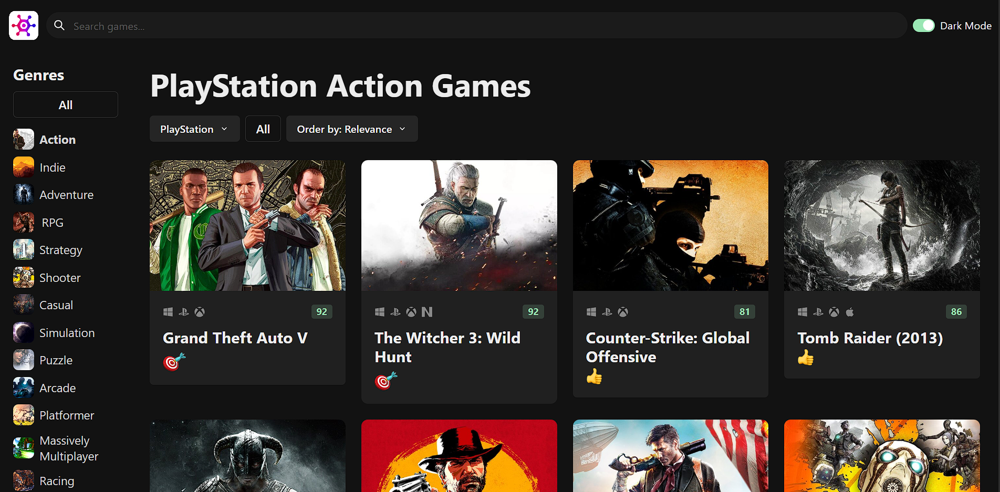

# Game Hub

Game Hub is a community-driven platform for gamers to discover their favorite games.

## Project Overview

Game Hub is designed to create a hub for gamers to discover new games.

## Technologies Used

- TypeScript
- React
- React Router
- Chakra UI
- React Icons
- React Infinite Scroll Component
- Zustand
- Axios
- React Query
- Vite
- bad-words
- ms

## Installation Instructions

1. Clone the repository: `git clone https://github.com/EzzElddin-AbdAllah/game-hub`
2. Install dependencies: `npm install`
3. Get a RAWG API key at https://rawg.io/apidocs. You'll have to create an account first.
4. Add the API key to src/services/api-client.ts
5. Start the application: `npm run dev`

Visit [http://localhost:3000](http://localhost:3000) to access Game Hub locally.

## Usage Examples

Here's a screenshot of the Game Hub in action. You can explore games, join discussions, and discover new titles.

## Code Structure

The codebase is organized as follows:

- `src/`: Contains the main application code.
- `public/`: Static assets.

## API Documentation

We use external APIs for game data. You can access these APIs by visiting [API Documentation](https://api.rawg.io/docs).

## Deployment

Game Hub is deployed on [game-hub-ezzelddin-abdallahs-projects.vercel.app](https://game-hub-ezzelddin-abdallahs-projects.vercel.app). We used Vercel for seamless deployment.
